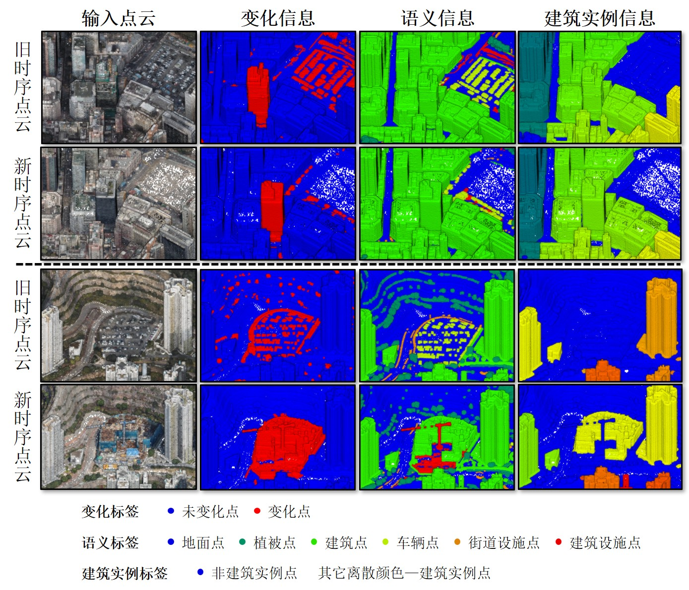

# HKMGCD

         

# Overview

中国香港三维点云多粒度变化检测数据集（HKMGCD）通过双时序倾斜摄影点云描述了中国香港九龙部分地区在2017年到2018年间的城市变化情况。HKMGCD覆盖范围广泛，占地约8.1平方公里，共包含约1.3亿个点，提供了丰富的三维点云多粒度变化检测样本。其拥有RGB属性，能有效反映地物的纹理材质，数据具有良好的真实性。该数据集共包含3个子数据集，分别为二分类变化检测数据集、语义变化检测数据集以及建筑实例变化检测数据集，分别可通过以下链接获取。

二分类变化检测数据集：https://figshare.com/articles/dataset/HKCD/30204376

语义变化检测数据集：下载地址"https://pan.baidu.com/s/12c9h_iDtNmCyI-ovFjMUGg"。通过咨询邮箱"zhanwenxiao@whu.edu.cn"获取链接密码。

建筑实例变化检测数据集：下载地址"https://pan.baidu.com/s/1DubFFnj3PdHaTuuuhnGWPg"。通过咨询邮箱"zhanwenxiao@whu.edu.cn"获取链接密码。
